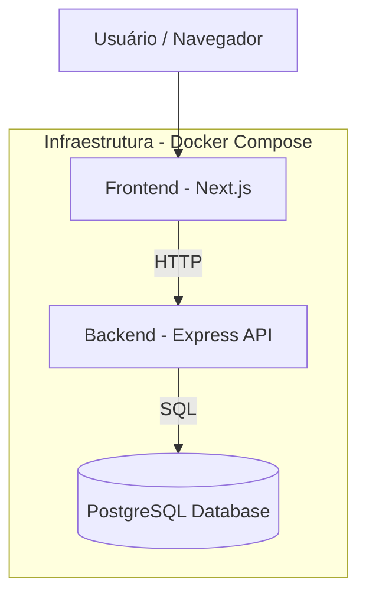

# 🚀 Plataforma de Gestão para Grupos de Networking

### 👤 Desenvolvido por: **Igor Albuquerque Lucena**

---

## 📋 Sumário

1. [Visão Geral](#-visão-geral)
2. [Arquitetura da Solução](#-arquitetura-da-solução)
3. [Funcionalidades Implementadas](#-funcionalidades-implementadas)
4. [Tecnologias Utilizadas](#-tecnologias-utilizadas)
5. [Como Rodar o Projeto (Docker Compose)](#️-como-rodar-o-projeto-docker-compose)
6. [Execução de Testes](#-execução-de-testes)
7. [Endpoints Principais da API](#-endpoints-principais-da-api)
8. [Frontend](#-frontend)
9. [Estrutura de Pastas](#-estrutura-de-pastas)
10. [Próximos Passos e Melhorias Futuras](#-próximos-passos-e-melhorias-futuras)

---

## 💡 Visão Geral

Este projeto foi desenvolvido como parte de um **Desafio Técnico Fullstack**, com o objetivo de digitalizar a gestão de grupos de networking — substituindo planilhas e controles manuais por uma plataforma moderna, automatizada e escalável.

O fluxo principal cobre:

- Formulário público de intenção de participação;
- Painel administrativo de aprovação/rejeição;
- Geração de convites/token;
- Cadastro completo via token;
- Dashboard de performance com métricas e gráfico.

---

## 🏗 Arquitetura da Solução

A solução é **100% containerizada** via **Docker Compose**, composta por três serviços:

- 🐘 **PostgreSQL** — banco de dados relacional;
- ⚙️ **Backend (Node.js + Express)** — API RESTful;
- 💻 **Frontend (Next.js + React)** — interface web.



📘 Documento de arquitetura completo: [`architecture_with_image_pt.md`](./docs/architecture_with_image_pt.md)

---

## ⚙️ Funcionalidades Implementadas

### 🔹 Módulo Obrigatório — Admissão de Membros

- [x] Formulário público de intenção
- [x] Painel administrativo para aprovação/rejeição
- [x] Geração de token de convite
- [x] Cadastro completo com token válido
- [x] Persistência no PostgreSQL

### 🔹 Módulo Opcional — Dashboard de Performance

- [x] Indicadores: membros, indicações, obrigados
- [x] Gráfico com Recharts
- [x] Filtro de período
- [x] Top 3 membros
- [x] Animações com Framer Motion

OBS: os dados estão mockados.

---

## 🧰 Tecnologias Utilizadas

| Área               | Tecnologias                                                      |
| ------------------ | ---------------------------------------------------------------- |
| **Frontend**       | Next.js, React, TypeScript, TailwindCSS, Recharts, Framer Motion |
| **Backend**        | Node.js, Express, Celebrate/Joi, Jest, PostgreSQL                |
| **Infraestrutura** | Docker, Docker Compose                                           |
| **Testes**         | Jest, React Testing Library                                      |

---

## 🐳️ Como Rodar o Projeto (Docker Compose)

> O ambiente foi projetado **para rodar completamente dentro do Docker Compose**.  
> Nenhum passo adicional de configuração ou `.env` é necessário.

### 1️⃣ Clonar o repositório

```bash
git clone https://github.com/seuusuario/networking-platform.git
cd networking-platform
```

### 2️⃣ Subir todos os serviços

```bash
docker-compose up --build
```

O Compose irá:

- Subir o banco PostgreSQL (porta 5433 → 5432 interna);
- Subir o backend Node.js (porta 3001);
- Subir o frontend Next.js (porta 3000);
- Conectar todos automaticamente na rede interna do Docker.

### 3️⃣ Acessar os serviços

| Serviço                     | URL                   |
| --------------------------- | --------------------- |
| Frontend (Next.js)          | http://localhost:3000 |
| Backend (API Express)       | http://localhost:3001 |
| Banco de Dados (PostgreSQL) | localhost:5433        |

> ✅ Nenhuma configuração manual de `.env` ou dependências é necessária quando via Docker.

---

## 🧪 Execução de Testes

Os testes também podem ser executados **diretamente dentro dos containers**:

### Backend

```bash
docker-compose exec backend npm run test
```

### Frontend

```bash
docker-compose exec frontend npm run test
```

Todos os testes utilizam **Jest** e **React Testing Library**, validando:

- Fluxo de intenções e cadastro (backend);
- Componentes selecionados (frontend).

---

## 🔌 Endpoints Principais da API

| Método  | Rota                      | Descrição                      |
| ------- | ------------------------- | ------------------------------ |
| `POST`  | `/intentions`             | Cria nova intenção             |
| `GET`   | `/intentions`             | Lista intenções existentes     |
| `PATCH` | `/intentions/:id/approve` | Aprova intenção e gera token   |
| `PATCH` | `/intentions/:id/reject`  | Rejeita intenção               |
| `POST`  | `/members/register`       | Cadastra novo membro via token |

---

## 💻 Frontend

| Caminho             | Função                   |
| ------------------- | ------------------------ |
| `/intentions`       | Formulário público       |
| `/admin/intentions` | Painel administrativo    |
| `/register/[token]` | Cadastro via convite     |
| `/`                 | Dashboard de performance |

📱 Totalmente responsivo e otimizado para mobile.

---

## 📁 Estrutura de Pastas

### Backend

```
src/
├── controllers/
├── services/
├── repositories/
├── routes/
├── utils/
├── middlewares/
├── tests/
└── config/
```

### Frontend

```
pages/
├── intentions/
├── admin/intentions/
├── register/[token].tsx
└── index.tsx (Dashboard)
components/
├── Header.tsx
├── Button.tsx
├── Dashboard/
└── Table.tsx
services/
└── intentions.service.ts
```

---

## 🚧 Próximos Passos e Melhorias Futuras

- Adicionar **autenticação real (JWT)** com roles.
- Implementar módulo de **Indicações e Obrigados**.
- Tratamento global de erros no backend.
- Melhorar cobertura de testes unitários e e2e.
- Adicionar exportação de relatórios XLS/PDF.

---

## 🏁 Conclusão

O projeto foi projetado com foco em:

- **Arquitetura limpa e modular**;
- **Execução 100% automatizada via Docker Compose**;
- **Facilidade de uso e reprodutibilidade**;
- **Testes**.

Basta um comando para subir todo o ambiente:

```bash
docker-compose up --build
```

E outro para executar todos os testes:

```bash
docker-compose exec backend npm run test
```

---

🧩 **Entrega completa e funcional**, pronta para avaliação e demonstração.
