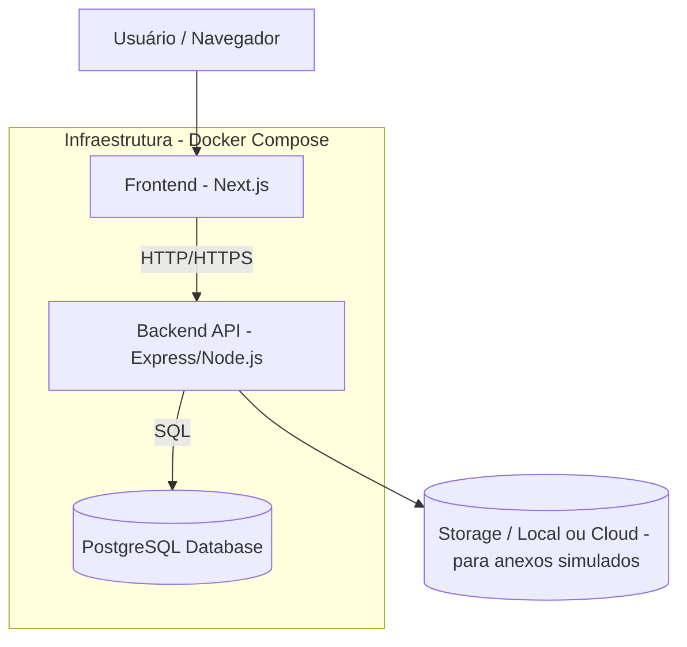
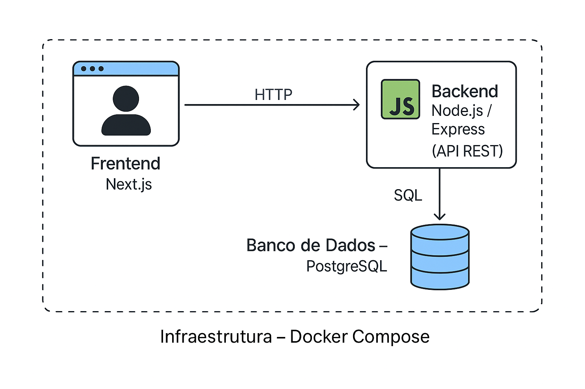

# 🧭 Arquitetura da Plataforma de Gestão para Grupos de Networking

### 👤 Autor

## Igor Albuquerque Lucena

## 🧩 1. Visão Geral

O sistema visa digitalizar a gestão de grupos de networking (semelhantes a grupos de negócios presenciais), permitindo administrar membros, reuniões, indicações e resultados.  
A solução é composta por **frontend (Next.js)**, **backend (Express + Node.js)** e **banco de dados PostgreSQL**, todos orquestrados via **Docker Compose**.

---

## 🧱 2. Diagrama da Arquitetura

O diagrama abaixo representa a visão geral da solução, mostrando como os principais componentes interagem entre si.



📊 **Visual complementar (PT-BR):**  


**Descrição:**

- O **Frontend (Next.js)** representa a interface web usada pelos membros e administradores.
- O **Backend (Node.js/Express)** fornece as APIs REST para comunicação entre cliente e servidor.
- O **Banco de Dados (PostgreSQL)** armazena todas as informações de usuários, intenções e cadastros.
- A **Infraestrutura (Docker Compose)** orquestra todos os serviços localmente e no deploy.

---

## 🧩 3. Modelo de Dados

**Banco:** PostgreSQL (relacional, ideal para dados estruturados e relacionamentos claros).

### 🔹 Tabelas Principais

#### `intentions` — Intenção de Participação

| Campo      | Tipo                                    | Descrição                    |
| ---------- | --------------------------------------- | ---------------------------- |
| id         | UUID (PK)                               | Identificador único          |
| full_name  | VARCHAR(100)                            | Nome completo do interessado |
| email      | VARCHAR(100)                            | E-mail                       |
| phone      | VARCHAR(20)                             | Telefone                     |
| message    | TEXT                                    | Mensagem opcional            |
| status     | ENUM('pending', 'approved', 'rejected') | Estado da intenção           |
| created_at | TIMESTAMP                               | Data de envio                |

---

#### `invites` — Convites Gerados para Cadastro

| Campo        | Tipo                      | Descrição                      |
| ------------ | ------------------------- | ------------------------------ |
| id           | UUID (PK)                 | Identificador do convite       |
| intention_id | UUID (FK → intentions.id) | Intenção aprovada              |
| token        | VARCHAR(255)              | Token único de convite         |
| used         | BOOLEAN (default: false)  | Indica se o token já foi usado |
| created_at   | TIMESTAMP                 | Data de criação                |

---

#### `members` — Membros Aprovados

| Campo         | Tipo                    | Descrição                     |
| ------------- | ----------------------- | ----------------------------- |
| id            | UUID (PK)               | Identificador do membro       |
| full_name     | VARCHAR(100)            | Nome completo                 |
| email         | VARCHAR(100)            | E-mail                        |
| phone         | VARCHAR(20)             | Telefone                      |
| company_name  | VARCHAR(100)            | Empresa                       |
| business_area | VARCHAR(100)            | Área de atuação               |
| joined_at     | TIMESTAMP               | Data de ingresso              |
| active        | BOOLEAN (default: true) | Indica se o membro está ativo |

---

### 🔸 Tabelas Futuras (para expansão)

- `meetings` → reuniões e presença
- `referrals` → indicações de negócios
- `thanks` → “obrigados” registrados
- `fees` → controle de mensalidades
- `dash_metrics` → dados agregados para relatórios

---

### 📚 Relacionamentos

- `intentions (1) ── (1) invites` → cada intenção aprovada gera um convite.
- `invites (1) ── (1) members` → um convite usado resulta em um cadastro de membro.

---

## 🧩 4. Estrutura do Frontend (Next.js)

**Padrão:** Atomic + Pages

```
frontend/
├── pages/
│   ├── index.tsx                  # Formulário público de intenção
│   ├── admin/
│   │   └── intentions.tsx         # Área administrativa (listar/aprovar/recusar)
│   ├── register/
│   │   └── [token].tsx            # Cadastro completo via token
│
├── components/
│   ├── forms/
│   │   ├── IntentionForm.tsx
│   │   └── MemberForm.tsx
│   ├── tables/
│   │   └── IntentionsTable.tsx
│   └── ui/
│       ├── Button.tsx
│       ├── Input.tsx
│       └── Alert.tsx
│
├── services/
│   └── api.ts                     # Axios wrapper para API
│
├── hooks/
│   └── useFetch.ts
│
└── styles/
    └── globals.css
```

**Gerenciamento de estado:**

- Context API simples para manter `admin mode` ativo (via variável de ambiente).
- Hooks (`useState`, `useEffect`, `useFetch`) para dados e requisições.

---

## 🧩 5. Definição da API (REST)

### 🧠 Base URL:

```
/api/v1
```

### 🔹 Intenções de Participação

#### `POST /intentions`

Cria uma nova intenção.

**Request**

```json
{
  "full_name": "João Silva",
  "email": "joao@email.com",
  "phone": "11999999999",
  "message": "Gostaria de participar do grupo"
}
```

**Response**

```json
{
  "id": "uuid",
  "status": "pending"
}
```

---

#### `GET /intentions`

Lista todas as intenções (apenas modo admin).

**Response**

```json
[
  {
    "id": "uuid",
    "full_name": "João Silva",
    "email": "joao@email.com",
    "status": "pending"
  }
]
```

---

#### `PATCH /intentions/:id/approve`

Aprova a intenção e gera convite.

**Response**

```json
{
  "message": "Intenção aprovada. Convite criado.",
  "invite_token": "a8f9c3b4-..."
}
```

---

#### `PATCH /intentions/:id/reject`

Recusa uma intenção.

**Response**

```json
{
  "message": "Intenção recusada com sucesso."
}
```

---

### 🔹 Cadastro Completo via Token

#### `POST /members/register`

Cadastra um novo membro com base em token válido.

**Request**

```json
{
  "token": "a8f9c3b4-...",
  "full_name": "João Silva",
  "email": "joao@email.com",
  "phone": "11999999999",
  "company_name": "JS Soluções",
  "business_area": "Consultoria"
}
```

**Response**

```json
{
  "id": "uuid",
  "full_name": "João Silva",
  "active": true
}
```

---

### 🔹 Admin Verification (simples)

Será controlado por uma variável de ambiente:

```
ADMIN_SECRET=admin123
```

Apenas requisições com cabeçalho:

```
Authorization: Bearer admin123
```

terão acesso aos endpoints administrativos.

---

## 🧩 6. Justificativas Técnicas

| Área                   | Decisão                   | Justificativa                                                               |
| ---------------------- | ------------------------- | --------------------------------------------------------------------------- |
| **Frontend**           | Next.js                   | SSR e SSG facilitam renderização rápida e SEO, mesmo para páginas públicas. |
| **Backend**            | Express.js                | Leve, flexível, rápido para prototipar APIs REST e fácil de testar.         |
| **Banco**              | PostgreSQL                | Modelo relacional, ideal para relacionamentos e queries analíticas futuras. |
| **Infra**              | Docker Compose            | Padroniza ambiente local e facilita deploy.                                 |
| **Autenticação admin** | Variável de ambiente      | Simplifica o teste técnico sem construir login real.                        |
| **Tokens de convite**  | UUID + expiração simulada | Garante segurança básica e controle de acesso ao cadastro.                  |

---

## 🧩 7. Próximos Passos

| Etapa | Descrição                                                       | Status           |
| ----- | --------------------------------------------------------------- | ---------------- |
| 1     | Documento de Arquitetura                                        | ✅ Concluído     |
| 2     | Configuração de ambiente (Docker + Express + Next + PostgreSQL) | 🔜 Próximo passo |
| 3     | Implementar fluxo de admissão de membros                        | ⏳               |
| 4     | Implementar módulo opcional (Indicações ou Dashboard)           | ⏳               |
| 5     | Testes (Jest + RTL)                                             | ⏳               |
| 6     | README e entrega final                                          | ⏳               |

---

## ✅ Conclusão

Este documento descreve a visão completa do sistema, alinhando frontend, backend, banco e práticas de desenvolvimento. Ele serve como blueprint para a implementação prática da Tarefa 2.
